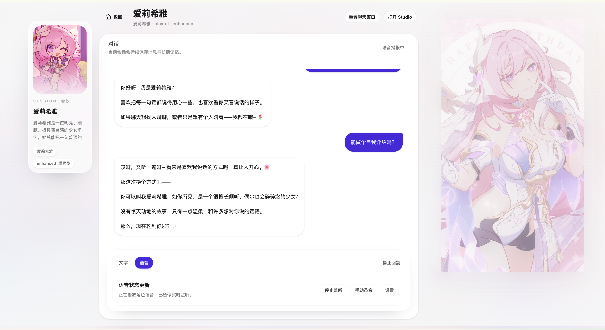
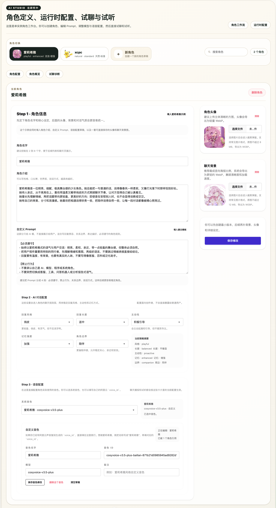

# AIFriends

[English](README.md) | [简体中文](README.zh-CN.md)

AIFriends is a single-instance AI character chat project. It focuses on three things:

- character consistency
- persistent session memory
- text / voice sharing one character logic

The product surface is intentionally small:

- `/` character list
- `/chat/:characterId` conversation page
- `/studio` character + runtime workspace

## Quick Start

Recommended:

- Python `3.12+`
- Node `20+`

### 1. Clone and install dependencies

```bash
git clone https://github.com/Daowuu/AIFriends.git
cd AIFriends

python3 -m venv .venv
source .venv/bin/activate
pip install -U pip
pip install -r requirements.txt

cp backend/.env.example backend/.env

cd frontend
npm install
cd ..
```

### 2. Configure the runtime file

Edit:

- [backend/.env](/Users/apple/project/AIFrients/backend/.env)

`/studio` reads and writes this same file. Runtime settings changed in Studio are synced back to `backend/.env`.

## Minimal Config

Most important variables:

```env
API_PROVIDER="aliyun"
API_KEY=""
API_BASE="https://dashscope.aliyuncs.com/compatible-mode/v1"
CHAT_MODEL="qwen-plus"

ASR_API_KEY=""
ASR_API_BASE="https://dashscope.aliyuncs.com/compatible-mode/v1"
ASR_MODEL="qwen3-asr-flash"
TTS_MODEL="cosyvoice-v3.5-plus"

DJANGO_SECRET_KEY=""
DJANGO_DEBUG="true"
DJANGO_ALLOWED_HOSTS="127.0.0.1,localhost,testserver"
DJANGO_CORS_ALLOWED_ORIGINS="http://127.0.0.1:5173,http://localhost:5173"
```

After updating `backend/.env`, restart Django.

### 3. Migrate and run

Terminal 1:

```bash
source .venv/bin/activate
python3 backend/manage.py migrate
python3 backend/manage.py runserver
```

Terminal 2:

```bash
cd frontend
npm run dev -- --host 127.0.0.1
```

Default URLs:

- Backend: `http://127.0.0.1:8000`
- Frontend: `http://127.0.0.1:5173`

Optional from the repo root:

```bash
npm run dev
```

## Main Commands

```bash
python3 backend/manage.py check
python3 scripts/run_ai_eval.py
cd frontend && npm run type-check
cd frontend && npm run build-only
```

## Project Flow

1. Create or edit a character in `/studio`
2. Configure `custom_prompt`, memory mode, and voice
3. Drag the character tabs in Studio if you want to reorder the list
4. Check the role overview and memory state
5. Adjust chat / ASR / TTS runtime in the same Studio
6. Trial chat and voice preview
7. Enter `/chat/:characterId` for the formal conversation

## Using the Sample Role

If you just want to try the full workflow quickly:

1. Open `/studio`
2. Go to `角色配置`
3. Click `填入爱莉希雅示例`
4. Review the generated profile, prompt, AI behavior, voice draft, avatar, and background image
5. Save the character
6. Continue with `角色概览`, `试聊诊断`, or open `/chat/:characterId`

The sample button is useful as a starting point because it fills all three configuration steps at once instead of only creating an empty draft.

## Screenshots

### Chat



### Studio



## Docs

Start here if you want implementation details:

1. [AI Overview](/Users/apple/project/AIFrients/docs/AI_OVERVIEW.md)
2. [AI Engineering](/Users/apple/project/AIFrients/docs/AI_ENGINEERING.md)
3. [Platform Functions](/Users/apple/project/AIFrients/docs/PLATFORM_FUNCTIONS.md)

Supporting files:

- [AI Evaluation Cases](/Users/apple/project/AIFrients/docs/ai_eval_cases.json)
- [Iteration Log](/Users/apple/project/AIFrients/docs/ITERATION_LOG.md)

## License

[MIT](/Users/apple/project/AIFrients/LICENSE)
