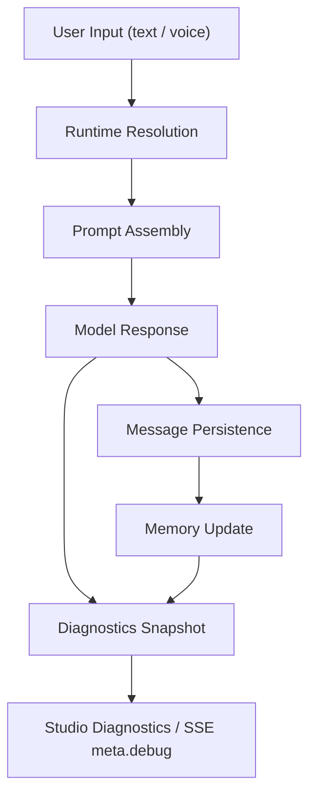

# AI Engineering

这份文档是 AIFriends 的 AI 工程总设计说明。  
它的目标是让后续开发者能回答：

1. 当前 AI 系统怎样工作
2. 哪些能力已经做了，为什么这样做
3. 哪些数据会影响角色能力
4. 每条链路的输入、输出、失败模式是什么
5. 以后如果要继续增强角色能力，应该从哪里动手

本文档面向：

- 当前项目维护者
- 后续接手的工程师
- 需要在角色一致性 / 记忆 / 语音 / 诊断方向持续迭代的人

---

## 1. 如何阅读这份文档

如果你第一次进入这个项目，建议按下面的顺序阅读：

1. 先看第 2 节，理解端到端链路
2. 再看第 3 节，理解五层职责边界
3. 再看第 4 节，理解哪些数据决定角色能力
4. 最后按需深入 runtime、conversation、memory、diagnostics、persona

## 2. 项目定位

AIFriends 当前聚焦在角色驱动的 AI 聊天体验。  
它的 AI 核心目标是：

- 让角色长期稳定地像自己
- 让角色和用户的关系具有连续性
- 让语音输入、文字输入、语音播报共享同一套角色逻辑
- 让创作者可控地塑造角色行为
- 让运行时和失败模式可诊断

当前 AI 工程的重点是：

- Prompt 工程
- 记忆工程
- 语音一致性
- Runtime 解析
- Diagnostics
- 创作者配置工程

---

## 3. 端到端链路

从一次用户输入到一次可诊断的角色回复，当前链路是：

1. 用户输入文字或语音
2. Runtime Layer 解析 chat / ASR / TTS 来源
3. Conversation Layer 组装 prompt layers
4. 模型生成回复
5. 回复写入 `Message`
6. Memory Layer 条件更新摘要、关系记忆和偏好记忆
7. Diagnostics Layer 生成本轮调试信息
8. Studio 或聊天页消费结果

## 4. AI 能力地图

当前系统可以分成 5 层：

1. `runtime`
2. `conversation`
3. `memory`
4. `diagnostics`
5. `persona`

它们之间的关系如下：

这 5 层是后续扩展时的真实边界。  
如果以后要增强角色能力，优先也是按这 5 层拆任务。

---

## 5. 代码入口与职责边界

当前主要代码入口如下：

- Runtime 解析：
  - [backend/web/ai_settings_service.py](/Users/apple/project/AIFrients/backend/web/ai_settings_service.py)
- 对话主链路：
  - [backend/web/chat_services.py](/Users/apple/project/AIFrients/backend/web/chat_services.py)
- 消息接口：
  - [backend/web/message_views.py](/Users/apple/project/AIFrients/backend/web/message_views.py)
- 角色配置与音色：
  - [backend/web/character_views.py](/Users/apple/project/AIFrients/backend/web/character_views.py)
- Studio 聚合接口：
  - [backend/web/studio_views.py](/Users/apple/project/AIFrients/backend/web/studio_views.py)
- 运行时设置接口：
  - [backend/web/ai_settings_views.py](/Users/apple/project/AIFrients/backend/web/ai_settings_views.py)
- 数据模型：
  - [backend/web/models.py](/Users/apple/project/AIFrients/backend/web/models.py)

前端主要入口：

- Studio：
  - [frontend/src/views/StudioView.vue](/Users/apple/project/AIFrients/frontend/src/views/StudioView.vue)
- 正式聊天页：
  - [frontend/src/views/ChatView.vue](/Users/apple/project/AIFrients/frontend/src/views/ChatView.vue)
- 创作者角色表单：
  - [frontend/src/components/CharacterForm.vue](/Users/apple/project/AIFrients/frontend/src/components/CharacterForm.vue)
- Runtime 设置：
  - [frontend/src/views/ApiSettingsView.vue](/Users/apple/project/AIFrients/frontend/src/views/ApiSettingsView.vue)

---

## 6. 数据模型：哪些数据决定角色能力

### 4.1 Character

`Character` 决定角色本体和创作者配置。

关键字段：

- `name`
- `profile`
- `custom_prompt`
- `voice`
- `reply_style`
- `reply_length`
- `initiative_level`
- `memory_mode`
- `persona_boundary`
- `tools_enabled`
- `tools_require_confirmation`
- `tools_read_only`

作用：

- `profile`：角色的公开设定基础
- `custom_prompt`：创作者给模型的硬规则
- `reply_style / reply_length / initiative_level / persona_boundary`：结构化行为控制
- `memory_mode`：决定记忆注入和刷新频率
- `voice`：决定语音播报时使用的音色

### 4.2 Friend

`Friend` 表示“某个用户和某个角色之间”的关系，会话能力主要挂在这里。

关键字段：

- `user`
- `character`
- `conversation_summary`
- `relationship_memory`
- `user_preference_memory`
- `memory_updated_at`
- `memory_refresh_attempted_at`
- `last_debug_snapshot`
- `last_debug_at`

作用：

- `conversation_summary`：长对话摘要
- `relationship_memory`：角色与用户的关系状态
- `user_preference_memory`：用户称呼、喜好、边界等
- `memory_updated_at`：最近成功刷新记忆的时间
- `memory_refresh_attempted_at`：用于失败冷却
- `last_debug_snapshot`：最近一次试聊或聊天的诊断快照

### 4.3 Message

`Message` 存真实消息历史。

关键字段：

- `friend`
- `role`
- `content`
- `created_at`

作用：

- 支撑聊天记录加载
- 支撑最近历史窗口注入
- 支撑记忆刷新 transcript 构造

### 4.4 UserAISettings

`UserAISettings` 决定用户级运行时配置。

关键字段：

- `enabled`
- `provider`
- `api_key`
- `api_base`
- `model_name`
- `chat_supports_dashscope_audio`
- `asr_enabled`
- `asr_api_key`
- `asr_api_base`
- `asr_model_name`

作用：

- 用户是否启用个人聊天模型
- 是否启用独立 ASR
- 是否允许聊天配置复用到 DashScope 音频链路

### 4.5 Voice

`Voice` 决定角色播报时可选音色。

关键字段：

- `name`
- `provider`
- `source`
- `model_name`
- `voice_code`
- `description`

作用：

- 系统音色和自定义音色的统一抽象
- 角色编辑页和试听页的统一音色来源

---

## 7. Runtime Layer 详细逻辑

### 5.1 聊天 runtime 解析

聊天 runtime 当前解析顺序：

1. 读取用户级聊天配置
2. 如果用户未启用个人配置，读取服务端默认配置
3. 如果用户启用了个人配置但缺 key / base / model，返回 `invalid`
4. 如果用户和服务端都没有配置，返回 `missing`
5. 只有配置完整时返回 `ok`

输出包括：

- `chat_runtime`
- `chat_runtime_status`
- `chat_runtime_reason`

这层的关键原则：

- `invalid` 会直接暴露配置错误
- `missing` 会进入服务端保底逻辑

### 5.2 DashScope 音频复用

聊天配置是否允许复用给 ASR/TTS，当前由 3 层判定：

1. 用户显式开启 `chat_supports_dashscope_audio`
2. provider 本身是 `aliyun`
3. `api_base` 命中 DashScope 域名兜底

同时输出：

- `dashscope_audio_reuse_source`

它用于告诉系统和 Studio：

- 这是用户主动开启的
- 还是 provider 默认推断的
- 还是域名兜底出来的

### 5.3 ASR runtime

ASR 解析顺序：

1. 用户独立 ASR 配置
2. 复用聊天配置
3. 服务端默认 ASR 配置

如果都不可用，则 ASR runtime 为空。

### 5.4 TTS runtime

TTS 当前依赖 DashScope 音频链路：

1. 先拿到一个可用的 DashScope runtime
2. 再把 HTTP / compatible base 映射成 WebSocket TTS 地址
3. 挂上 TTS 模型名

这意味着：

- TTS 与 DashScope 音频链路共同组成一条可复用语音路径
- TTS 运行依赖可用的音频 runtime

---

## 8. Conversation Layer 详细逻辑

### 6.1 聊天入口

聊天接口入口是：

- `POST /api/friend/message/chat/`

它接收：

- `friend_id`
- `message`

### 6.2 处理顺序

当前主链路顺序：

1. 校验 `friend_id`
2. 校验消息非空
3. 解析 runtime
4. 组装 prompt layers
5. 加载最近历史窗口
6. 走模型流或 fallback 流
7. 清洗 `<think>` 内容
8. 持久化消息
9. 更新记忆
10. 生成 debug 快照
11. 通过 SSE 回传 `meta.debug`

### 6.2.1 前端发送顺序控制

正式聊天页当前采用顺序发送策略。  
如果用户在上一轮回复尚未结束时继续发送消息：

1. 新消息会先进入前端队列
2. 用户消息会先显示在聊天窗口中
3. 当前流式回复结束后，再按顺序发送下一条

这样做的目的有两个：

- 避免后发消息中断前一轮回复，导致前文被覆盖
- 保证后端构造上下文时，用户的多条连续输入仍按顺序进入会话

这意味着当前正式聊天更接近“串行会话流”：

- 单轮回复期间允许继续输入文字
- 后续消息按队列顺序处理
- 切换角色或卸载聊天页时会清空旧队列，避免串到别的会话

### 6.3 Prompt Layers

当前 prompt 采用固定层次：

1. `platform`
2. `voice`
3. `persona`
4. `character_prompt`
5. `creator_ai`
6. `memory`
7. `recent_dialogue`

优先级原则：

- 平台规则 > 角色设定 > 创作者 Prompt > 结构化 AI 配置 > 记忆 > 最近历史

### 6.4 历史窗口

当前会对历史消息做窗口化编排。  
系统只取最近若干条消息作为短窗口，再配合长记忆使用。

这样做是为了平衡：

- 成本
- 响应速度
- 角色连续性

在这个基础上，前端顺序发送队列补足了“短时间内多条用户输入”的连续性，避免只有最后一条进入有效回复链路。

### 6.5 Fallback

fallback 只在 `runtime = missing` 时触发。  
当前 fallback 是本地最低可用回复，用来保证：

- UI 可调试
- 主链路不至于完全空白

但它不代表正式产品能力。

### 6.6 内容清洗

当前会统一清洗：

- `<think>...</think>`
- 不完整 `<think>` 尾巴

这一步是为了避免模型内部推理内容直接泄露给用户。

---

## 9. Memory Layer 详细逻辑

### 7.1 为什么是三段式记忆

当前采用轻量数据库记忆方案。  
系统直接在关系对象上维护：

- `conversation_summary`
- `relationship_memory`
- `user_preference_memory`

因为当前主要目标是：

- 让角色记得“我们是什么关系”
- 让角色记得“用户喜欢什么”
- 让长对话不要很快失忆

三段式记忆已经足够服务这个阶段。

### 7.2 每轮都做的部分：偏好提取

每轮用户发消息后，都会先做一轮便宜的启发式提取。  
当前重点抽：

- 称呼偏好
- 喜欢的东西
- 不喜欢的东西
- 近期想聊的话题

然后会做：

1. 文本规范化
2. 去重
3. 长度截断
4. 回写 `user_preference_memory`

这一层不依赖额外模型。

### 7.3 条件触发的部分：摘要刷新

摘要刷新不会每轮都跑，必须先通过 gating：

1. `memory_mode` 非关闭
2. 有足够的新 transcript
3. 达到 assistant 轮次阈值，或摘要为空
4. 不在失败冷却窗口内

通过后才会请求模型做摘要整理。

### 7.4 摘要整理输入

摘要刷新时会把这些信息给模型：

- 角色名
- 角色设定
- 已有摘要
- 已有关系记忆
- 已有偏好记忆
- 最近几轮对话 transcript

目标是：

- 提炼稳定信息
- 不记流水账
- 不重写角色设定
- 不虚构

### 7.5 摘要整理输出

当前要求模型返回一个 JSON 对象，包含：

- `conversation_summary`
- `relationship_memory`
- `user_preference_memory`

如果 provider 不支持 JSON response format，会做降级兼容。

### 7.6 失败模式

当前 Memory Layer 会显式区分这些状态：

- `disabled`
- `not_triggered`
- `cooldown`
- `empty_transcript`
- `unsupported_json_mode`
- `provider_error`
- `model_refresh`

这能帮助判断：

- 是没触发
- 是冷却中
- 还是 provider 真出问题了

### 7.7 当前边界

记忆当前的边界是：

- 不跨角色共享
- 不跨用户共享
- 不能覆盖角色设定
- 仍然是同步 best-effort

如果未来响应延迟成为瓶颈，再考虑异步化。

---

## 10. Persona Layer 详细逻辑

### 8.1 Persona 不只是 profile

当前角色能力由两部分构成：

#### 面向用户的角色信息

- `name`
- `profile`
- 头像
- 背景图

#### 面向模型的角色控制

- `custom_prompt`
- `reply_style`
- `reply_length`
- `initiative_level`
- `memory_mode`
- `persona_boundary`
- 工具边界预留字段

### 8.2 创作者如何真正影响角色

当前创作者通过下面这些结构化入口塑造角色：

- `profile` 决定角色是谁
- `custom_prompt` 决定角色必须怎么说
- 结构化 AI 配置决定风格、长度、主动性和边界

所以 `Persona Layer` 实际上是“自由文本 + 结构化控制”的混合体系。

### 8.3 当前推荐写法

`custom_prompt` 推荐至少拆成四段：

- 必须遵守
- 禁止行为
- 关系边界
- 说话方式

这比写一整段松散说明更容易稳定角色。

---

## 11. Diagnostics Layer 详细逻辑

### 9.1 为什么要做 diagnostics

没有 diagnostics，AI 系统的所有问题最后都会变成：

- “感觉不对”
- “好像没记住”
- “像是模型问题”

这类描述无法支撑后续迭代。

### 9.2 实时诊断

每轮聊天结束后，SSE 会附带一段 `meta.debug`，主要字段：

- `prompt_layers`
- `memory_injection`
- `memory_update`
- `runtime_source`
- `fallback_used`
- `error_tag`

这个输出面向：

- Studio 试聊
- 实时调试
- 本轮问题定位

### 9.3 最近快照

除了实时 debug，系统还会把最近一次调试结果落到：

- `Friend.last_debug_snapshot`
- `Friend.last_debug_at`

这个输出面向：

- Studio “最近实验摘要”
- 刷新后仍可见的最近结果
- 跨轮次、跨页面的调试回显

### 9.4 当前 diagnostics 已经能回答的问题

当前基本能回答：

- 这一轮用了哪些 prompt layers
- 这一轮有没有注入摘要 / 关系记忆 / 偏好记忆
- 这一轮有没有触发记忆更新
- 这一轮到底是哪个 runtime 在跑
- 有没有走 fallback
- 出错时错误标签是什么

---

## 12. 语音链路

### 10.1 语音输入

语音输入通过 ASR 把音频转成文本，最后仍然进入同一条聊天主链。  
也就是说：

- 打字输入
- 语音输入

最终都会进入同一个 prompt 与记忆系统。

### 10.2 语音播报

角色回复后，如果启用了音色，会优先尝试服务端 TTS。  
如果服务端 TTS 不可用，再回退到其他播报方式。

### 10.3 为什么语音与角色主链统一

语音当前与角色主链共享同一套角色系统：

- 输入侧接到 Conversation Layer
- 输出侧接到角色音色与 TTS

所以语音能力提升的核心不只是识别率或播报质量，还包括：

- 内容认知与产品事实一致
- 播报不破坏角色感
- 语音输入不会绕过角色逻辑

---

## 13. Studio 在 AI 工程里的职责

Studio 是创作者实验台。

它承担的职责包括：

- 编辑角色公开信息
- 编辑 `custom_prompt`
- 编辑 AI 行为配置
- 编辑音色配置
- 试听音色
- 试聊角色
- 查看 runtime summary
- 查看最近调试结果

所以 Studio 的意义在于：

> 让创作者能够在同一处定义角色、试验角色、诊断角色。

---

## 14. 当前最需要继续优化的地方

### 12.1 角色一致性

继续提升：

- 角色不跳出设定
- 角色长期语气稳定
- 角色在语音场景下不自我矛盾

### 12.2 记忆质量

继续提升：

- 偏好提取稳定性
- 关系记忆稳定性
- 摘要刷新质量
- 冷却策略合理性

### 12.3 Diagnostics

继续提升：

- provider 兼容分类
- 更细的错误标签
- 延迟与质量指标
- 评估结果可对照

### 12.4 创作者 Prompt 工程化

继续提升：

- 给 `custom_prompt` 更强模板
- 给角色控制更好的解释
- 减少创作者“盲写 prompt”成本

---

## 15. 评估与回归

当前 repo 已经有轻量评估清单：

- [ai_eval_cases.json](/Users/apple/project/AIFrients/docs/ai_eval_cases.json)
- [run_ai_eval.py](/Users/apple/project/AIFrients/scripts/run_ai_eval.py)

当前评估重点是：

- 角色一致性
- 语音一致性
- 偏好记忆命中
- fallback 暴露正确性

这套评估现在以人工审阅为主。  
后续如果要继续加强角色能力，评估集应该先扩，再考虑更自动化评分。

---

## 16. 后续投入顺序建议

现阶段更适合排在角色能力主线之后的方向包括：

- 通用 RAG
- 通用 Agent
- 工具执行
- 多渠道接入
- 自动化工作流

这些方向都有价值，但当前阶段更适合把资源优先投入角色能力主线。

---

## 17. 一句话结论

AIFriends 当前 AI 工程的重点是：

让角色 **更稳定、更会记、更像自己、更能解释清楚自己为什么这样工作**。
